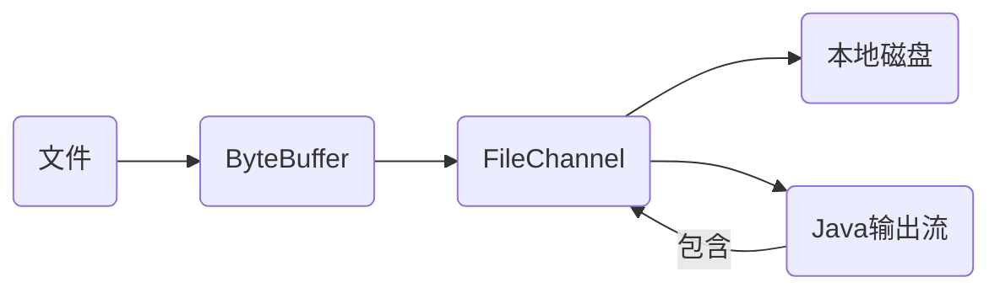
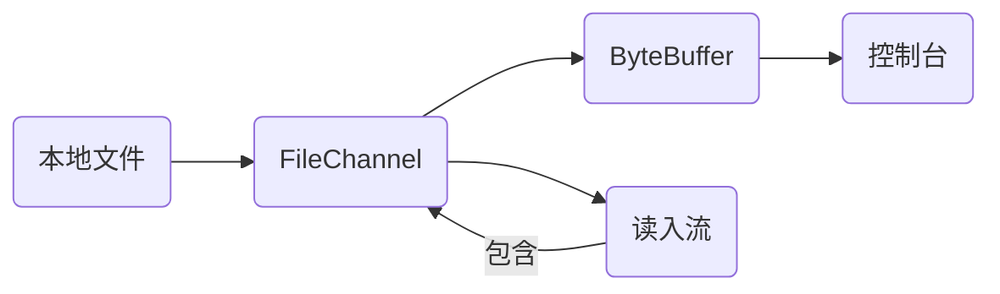
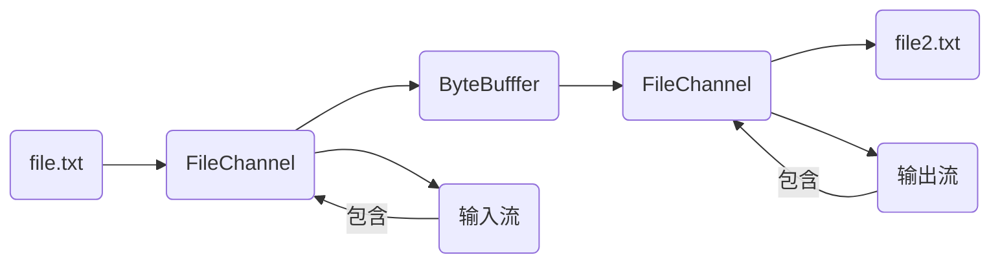
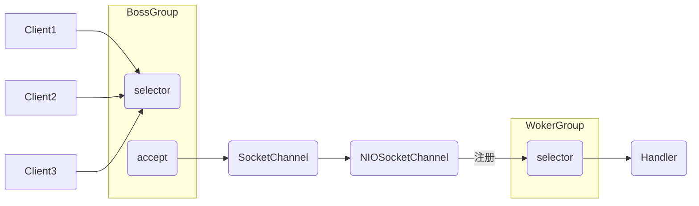
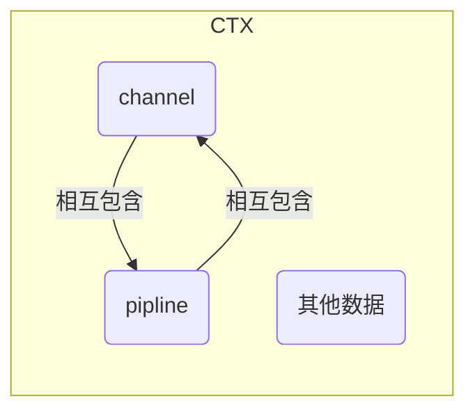

# 一、BIO 模型

## 1.1 介绍

传统的 IO 编程。`同步阻塞`一个连接对应一个线程，只要有客户端请求就得启动一个线程，尽管这个连接不操作，线程也依旧存在，造成资源浪费，可通过线程池改善，适用于连接数较少且固定的架构。

## 1.2 工作机制

1、服务器启动一个 ServerSocket。

2、客户端启动 Socket 对服务器进行通信，默认服务器与每个客户建立一个线程。

3、客户端发出请求，询问服务器有无线程响应，没有则等待或被拒绝。

4、有响应，客户端线程等待请求结束后，再继续执行。


## 1.3 BIO 实例

任务说明：

1）使用 BIO 模型编写服务端，监控 6666 端口，客户端连接时启动一个线程与之通讯。

2）要求使用线程池机制，连接多个客户端。

3）服务器接受客户端发送的数据（telent方式）

```java
package com.sugar.bio;

import java.io.IOException;
import java.io.InputStream;
import java.net.ServerSocket;
import java.net.Socket;
import java.util.concurrent.ExecutorService;
import java.util.concurrent.Executors;

/**
 * 功能描述: BIO 服务端
 *
 * @author XiaoNianXin
 * @date 2021/12/16 20:59
 */

public class BIOServer {
    public static void main(String[] args) throws IOException {
        // 1、创建线程池
        ExecutorService service = Executors.newCachedThreadPool();

        // 2、创建ServerSocket
        ServerSocket serverSocket = new ServerSocket(6666);
        System.out.println("服务器启动完毕！");

        // 3、监听,等待客户端连接
        while (true) {
            final Socket socket = serverSocket.accept();
            System.out.println("连接到一个客户端");
            // 创建线程
            service.execute(new Runnable() {
                @Override
                public void run() {
                    try {
                        handler(socket);
                    } catch (IOException e) {
                        e.printStackTrace();
                    }
                }
            });
        }
    }

    // 客户端通讯方法
    public static void handler(Socket socket) throws IOException {
        byte[] bytes = new byte[1024];
        // socket 获取输入流
        InputStream inputStream = socket.getInputStream();
        // 循环读取客户端发送的数据
        while (true) {
            int read = inputStream.read(bytes);
            if (read != -1) {
                System.out.println("客户端发送数据：" + new String(bytes));
            }else {
                break ;
            }
        }
        // 关闭 socket
        System.out.println("关闭客户端连接");
        socket.close();
    }
}
```

## 1.4 BIO 问题分析

1、每个请求都需创建新线程。

2、并发数较大时，需要创建大量线程，耗费资源。

3、建立连接后，当线程无数据可读时，`阻塞在 Read`操作上，浪费资源。


# 二、NIO 模型

## 2.1 介绍

NIO 包括三大核心 [Channel,Buffer,Selector]。面向`缓冲区、块`编程，数据读入缓存区，需要时在缓冲区中移动，增加处理灵活性，是`同步非阻塞`的高伸缩性网络。

## 2.2 工作机制

1、一个线程从通道发送请求或读取数据，仅能获得当前可用的数据。无数据可用时不读取，`但不会线程阻塞，在可用数据没来之前，该线程仍可做其他事情`。


2、一个线程可以处理多个客户端。假设有 1000 个请求，分配 100 线程，每个线程处理 10 个请求。不会像 BIO 分配 1000 个线程。


3、HTTP2.0 采用多路复用技术，同一个连接并发处理多个请求，并发数量比 HTTP1.1 高好几个数量级。

## 2.3 NIO 三大核心原理

1、一个 Channel 对应一个 Buffer。

2、一个线程对应一个 Selector ，多个 Channel 注册到同一个 Selector。

3、切换到某个 Channel 是由 Evenet 决定。

4、Selector 根据不同 Evenet 在 Channel 上切换连接。

5、BIO 要么输入流，要么输出流。NIO 可以双向读写，需要 flip 切换。

## 2.4 Buffer 使用

```java
package com.sugar.nio;

import java.nio.IntBuffer;

/**
 * 功能描述: Buffer 使用
 *
 * @author XiaoNianXin
 * @date 2021/12/22 10:27
 */
public class BasicBuffer {
    public static void main(String[] args) {
        // 创建 IntBuffer  - 存放 5 个 int 数据
        IntBuffer intBuffer = IntBuffer.allocate(5);

        // 填充数据
        for (int i = 0; i < 5; i++) {
            intBuffer.put(i * 2);
        }

        // 读数据
        intBuffer.flip();	// 反转 position
        while (intBuffer.hasRemaining()) {
            int i = intBuffer.get();
            System.out.println("i = " + i);
        }
    }
}
```

## 2.5 Channel 案例

1、本地文件写数据，将 "Hello Netty" 写入 "file.txt" 文件中。



```java
package com.sugar.nio;

import java.io.FileNotFoundException;
import java.io.FileOutputStream;
import java.io.IOException;
import java.nio.ByteBuffer;
import java.nio.channels.FileChannel;
import java.nio.charset.StandardCharsets;

/**
 * 功能描述: 本地文件写数据
 *
 * @author XiaoNianXin
 * @date 2021/12/22 11:25
 */
public class NIOFileChannel_01 {
    public static void main(String[] args) throws IOException {

        String data = "Hello Netty";

        // 创建输出流
        FileOutputStream fileOutputStream = new FileOutputStream("d:\\file.txt");

        // 获取 FileChannel
        FileChannel channel = fileOutputStream.getChannel();

        // 创建 Buffer
        ByteBuffer byteBuffer = ByteBuffer.allocate(1024);

        // 数据写入 Buffer
        byteBuffer.put(data.getBytes());

        // Buffer 写入 FileChannel
        byteBuffer.flip();
        channel.write(byteBuffer);

        // 关闭流
        fileOutputStream.close();
    }
}
```

2、本地文件读数据，将 "file.txt" 文件读入，显示控制台。



```java
package com.sugar.nio;

import java.io.*;
import java.nio.ByteBuffer;
import java.nio.channels.FileChannel;

/**
 * 功能描述: 本地文件读数据
 *
 * @author XiaoNianXin
 * @date 2021/12/22 11:41
 */
public class NIOFileChannel_02 {
    public static void main(String[] args) throws IOException {

        // 创建输入流
        FileInputStream inputStream = new FileInputStream(new File("d:\\file.txt"));

        // 获取 channel
        FileChannel channel = inputStream.getChannel();

        // 创建 Buffer
        ByteBuffer byteBuffer = ByteBuffer.allocate(1024);

        // 输入流写入 Buffer
        channel.read(byteBuffer);

        System.out.println(new String(byteBuffer.array()));
        inputStream.close();
    }
}
```

3、使用一个 Buffer 完成文件读写。



```java
package com.sugar.nio;

import java.io.*;
import java.nio.ByteBuffer;
import java.nio.channels.FileChannel;

/**
 * 功能描述:
 *
 * @author XiaoNianXin
 * @date 2021/12/22 11:56
 */
public class NIOFileChannel_03 {
    public static void main(String[] args) throws IOException {
        FileInputStream fileInputStream = new FileInputStream(new File("D:\\file.txt"));
        FileChannel channel_in = fileInputStream.getChannel();
        FileOutputStream fileOutputStream = new FileOutputStream("D:\\file2.txt");
        FileChannel channel_out = fileOutputStream.getChannel();

        ByteBuffer buffer = ByteBuffer.allocate(1024);
        // 循环读取
        while (true) {
            // 重置标记位
            buffer.clear();
            
            int write = channel_in.read(buffer);
            if (write == -1) {
                break ;
            }
            buffer.flip();
            channel_out.write(buffer);
        }
        // 关闭流
        fileInputStream.close();
        fileOutputStream.close();
    }
} 
```

4、拷贝文件

```java
package com.sugar.nio;

import java.io.*;
import java.nio.channels.FileChannel;

/**
 * 功能描述: 文件拷贝
 *
 * @author XiaoNianXin
 * @date 2021/12/22 13:49
 */
public class NIOFileChannel_04 {
    public static void main(String[] args) throws IOException {

        // 创建流
        FileInputStream fileInputStream = new FileInputStream(new File("d:\\a.jpg"));
        FileOutputStream fileOutputStream = new FileOutputStream("d:\\b.jpg");

        // 获取 Channel
        FileChannel channel_in = fileInputStream.getChannel();
        FileChannel channel_out = fileOutputStream.getChannel();

        // 完成拷贝
        channel_out.transferFrom(channel_in,0,channel_in.size());

        // 关闭流
        channel_in.close();
        channel_out.close();
        fileInputStream.close();
        fileOutputStream.close();
    }
}
```

5、Buffer 和 Channel 注意

- "buffer" put 什么类型，get 就应使用相同的类型读取。
- "buffer" 可以转成只读 buffer。
- NIO 提供 MappedByteBuffer，让`文件在内存中修改`，如何同步到文件由 NIO 完成。
- `NIO 支持多个 buffer 读写`。


```java
package com.sugar.nio;

import java.nio.ByteBuffer;

/**
 * 功能描述: Buffer put 和 get 需同类型
 *
 * @author XiaoNianXin
 * @date 2021/12/22 14:19
 */
public class NIOByteBufferPutGet {
    public static void main(String[] args) {

        ByteBuffer buffer = ByteBuffer.allocate(64);

        // 存入
        buffer.putInt(100);
        buffer.putLong(9);
        buffer.putChar('云');
        buffer.putShort((short)4);

        // 取出
        buffer.flip();
        System.out.println(buffer.getInt());
        System.out.println(buffer.getLong());
        System.out.println(buffer.getChar());
        System.out.println(buffer.getShort());
    }
}
```

```java
package com.sugar.nio;

import java.nio.ByteBuffer;

/**
 * 功能描述: 只读 Buffer
 *
 * @author XiaoNianXin
 * @date 2021/12/22 14:25
 */
public class ReadOnlyBuffer {
    public static void main(String[] args) {

        ByteBuffer buffer = ByteBuffer.allocate(64);

        for (int i = 0; i < 64; i++) {
            buffer.put((byte) i);
        }

        buffer.flip();

        // 只读 buffer
        ByteBuffer readOnlyBuffer = buffer.asReadOnlyBuffer();

        // 读取
        while (readOnlyBuffer.hasRemaining()) {
            byte b = readOnlyBuffer.get();
            System.out.println("b = " + b);
        }
    }
}
```

```java
package com.sugar.nio;

import java.io.IOException;
import java.io.RandomAccessFile;
import java.nio.MappedByteBuffer;
import java.nio.channels.FileChannel;

/**
 * 功能描述: 文件修改 - 内存 Buffer - 无需拷贝
 *
 * @author XiaoNianXin
 * @date 2021/12/22 14:32
 */
public class MappedByteBufferDemo {
    public static void main(String[] args) throws IOException {

        RandomAccessFile randomAccessFile = new RandomAccessFile("d:\\file.txt","rw");

        FileChannel channel = randomAccessFile.getChannel();

        /**
         * 参数1：读写模式
         * 参数2：修改起始位
         * 参数3：文件映射到内存的大小
         * 直接修改范围就是 [0,5)
         */
        MappedByteBuffer map = channel.map(FileChannel.MapMode.READ_WRITE, 0, 5);

        map.put(0,(byte) 'H');
        map.put(3,(byte) '9');

        randomAccessFile.close();

    }
}
```

## 2.6 Selector（多路复用器）

1、NIO 支持一个线程处理多个客户端，会使用到 `Selector 选择器`。

2、Selector 检测多个 Channel 事件发生，并获取事件相应处理。


## 2.7 NIO 与 BIO 比较

1、BIO 以流处理数据，NIO 以块，块比流 I/O 高很多。

2、BIO 阻塞，NIO 非阻塞。

3、NIO 单线程可监听多个客户端频道。

## 2.8 NIO 案例

1、服务器与客户端进行简单通讯，且非阻塞。

NIO Server：

```java
package com.sugar.nio.project;

import java.io.IOException;
import java.net.InetSocketAddress;
import java.nio.ByteBuffer;
import java.nio.channels.*;
import java.util.Iterator;
import java.util.Set;

/**
 * 功能描述: NIO 服务端 - 非阻塞
 *
 * @author XiaoNianXin
 * @date 2021/12/23 19:05
 */
public class NIOServer {
    public static void main(String[] args) throws IOException {
        // 创建频道
        ServerSocketChannel serverSocketChannel = ServerSocketChannel.open();

        // 得到 Selector
        Selector selector = Selector.open();

        // 绑定端口
        serverSocketChannel.socket().bind(new InetSocketAddress(6666));

        // 设置非阻塞
        serverSocketChannel.configureBlocking(false);

        // serverSocketChannel 注册到 Selector | ops：连接事件
        serverSocketChannel.register(selector, SelectionKey.OP_ACCEPT);

        // 监听客户端
        while (true) {
            if (selector.select(1000) == 0) { // 1s 内无连接事件发生,跳过
                System.out.println("服务器等待 1 s，无连接");
                continue;
            }
            // 有连接事件,获取相关 Key,反向获取频道
            Set<SelectionKey> selectionKeys = selector.selectedKeys();
            Iterator<SelectionKey> iterator = selectionKeys.iterator();
            while (iterator.hasNext()) {
                SelectionKey key = iterator.next();
                if (key.isAcceptable()) {   // 有新客户端连接
                    // 给客户端生成 SocketChannel
                    SocketChannel socketChannel = serverSocketChannel.accept();
                    socketChannel.configureBlocking(false);
                    // 注册到 selector 并分配 buffer[服务端]
                    socketChannel.register(selector,SelectionKey.OP_READ,ByteBuffer.allocate(1024));
                    System.out.println("客户端连接成功，生成Channel：" + socketChannel.hashCode());
                }
                if (key.isReadable()) {   // 读事件
                    // key 获取频道
                    SocketChannel channel = (SocketChannel) key.channel();
                    // key 获取 buffer[服务端]
                    ByteBuffer buffer = (ByteBuffer) key.attachment();
                    // 数据放入 buffer[服务端]
                    channel.read(buffer);
                    System.out.println("客户端发送数据：" + new String(buffer.array()));
                }
                // key 已被操作,移出 selectionKeys
                iterator.remove();
            }
        }

    }
}
```

NIO Client：

```java
package com.sugar.nio.project;

import java.io.IOException;
import java.net.InetSocketAddress;
import java.nio.ByteBuffer;
import java.nio.channels.SocketChannel;
import java.nio.charset.StandardCharsets;

/**
 * 功能描述: NIO - 客户端
 *
 * @author XiaoNianXin
 * @date 2021/12/23 19:46
 */
public class NIOClient {
    public static void main(String[] args) throws IOException {
        // 创建频道
        SocketChannel channel = SocketChannel.open();

        // 设置非阻塞
        channel.configureBlocking(false);

        // 连接失败 - 非阻塞
        if (!channel.connect(new InetSocketAddress("127.0.0.1",6666))) {
            while (!channel.finishConnect()) {
                System.out.println("连接需要时间，客户端不阻塞");
            }
        }

        // 连接成功
        String str = "Hello Netty";
        ByteBuffer buffer = ByteBuffer.wrap(str.getBytes());
        // 发送数据
        channel.write(buffer);
        System.in.read();
    }
}
```

2、NIO 群聊系统（非阻塞），支持多人群聊。服务端可以监控用户上下线且可以消息转发，客户端可发送消息，接受其他用户消息（由服务器转发得到）。

NIO Server：

```java
package com.sugar.nio.project1;

import java.io.IOException;
import java.net.InetSocketAddress;
import java.nio.ByteBuffer;
import java.nio.channels.*;
import java.util.Iterator;

/**
 * 功能描述: X聊天室 - 服务端
 *
 * @author XiaoNianXin
 * @date 2021/12/23 20:44
 */
public class XChatServer {
    // 定义属性
    private Selector selector;
    private ServerSocketChannel listenChannel;
    private static final int PORT = 6688;

    // 初始化
    public XChatServer() {
        try {
            selector = Selector.open();
            listenChannel = ServerSocketChannel.open();
            listenChannel.socket().bind(new InetSocketAddress(PORT));
            listenChannel.configureBlocking(false);
            listenChannel.register(selector, SelectionKey.OP_ACCEPT);
        } catch (IOException e) {
            e.printStackTrace();
        }

    }

    // 监听
    public void listen() {
        try {
            while (true) {
                int count = selector.select();
                if (count > 0) {
                    Iterator<SelectionKey> iterator = selector.selectedKeys().iterator();
                    while (iterator.hasNext()) {
                        SelectionKey key = iterator.next();
                        if (key.isAcceptable()) {
                            SocketChannel client_channel = listenChannel.accept();
                            client_channel.configureBlocking(false);
                            client_channel.register(selector,SelectionKey.OP_READ);
                            System.out.println(client_channel.getRemoteAddress().toString().substring(1) + " 上线！");
                        }
                        if (key.isReadable()) {
                            readData(key);
                        }
                        iterator.remove();
                    }
                }else {
                    System.out.println("等待中......");
                }
            }
        }catch (Exception e) {
            e.printStackTrace();
        }finally {
            // 异常处理
        }
    }

    // 从客户端读取数据
    public void readData(SelectionKey key) throws IOException {
        SocketChannel channel = null;
        try {
            channel = (SocketChannel) key.channel();
            ByteBuffer buffer = ByteBuffer.allocate(1024);
            int length = channel.read(buffer);
            if (length > 0) {
                // 服务端接受客户端消息
                String msg = new String(buffer.array());
                System.out.println("From 客户端：" + msg);
                // 消息群发给其他客户端 - 排除自己
                 sendMsgToAll(msg,channel);
            }
        }catch (IOException e) {
            System.out.println(channel.getRemoteAddress() + " 下线！");
            // 取消注册,关闭通道
            key.cancel();
            channel.close();
        }
    }

    // 转发消息
    public void sendMsgToAll(String msg,SocketChannel self) throws IOException {
        System.out.println("服务器转发消息中......");
        // 遍历所有key,并获取频道,将自己排除掉
        for (SelectionKey key : selector.keys()) {
            Channel target_channel = key.channel();
            if (target_channel instanceof SocketChannel && target_channel != self) {
                // 转发
                SocketChannel channel = (SocketChannel)target_channel;
                ByteBuffer buffer = ByteBuffer.wrap(msg.getBytes());
                channel.write(buffer);
            }
        }
    }

    public static void main(String[] args) {
        // 启动服务端
        XChatServer xChatServer = new XChatServer();
        xChatServer.listen();
    }
}
```

NIO Client：

```java
package com.sugar.nio.project1;

import java.io.IOException;
import java.net.InetSocketAddress;
import java.nio.ByteBuffer;
import java.nio.channels.SelectionKey;
import java.nio.channels.Selector;
import java.nio.channels.SocketChannel;
import java.util.Iterator;
import java.util.Scanner;

/**
 * 功能描述: X聊天室 - 客户端
 *
 * @author XiaoNianXin
 * @date 2021/12/23 21:09
 */
public class XChatClient {
    private final String HOST = "127.0.0.1";
    private final int PORT = 6688;
    private Selector selector;
    private SocketChannel socketChannel;
    private String UserName;

    public XChatClient() throws IOException {
        selector = Selector.open();
        socketChannel = SocketChannel.open(new InetSocketAddress(HOST,PORT));
        socketChannel.configureBlocking(false);
        socketChannel.register(selector, SelectionKey.OP_READ);
        UserName = socketChannel.getLocalAddress().toString().substring(1);
        System.out.println(UserName + " 成功连接服务器...");
    }

    public void sendMsg(String msg)  {
        msg = UserName + "：" + msg;
        try {
            socketChannel.write(ByteBuffer.wrap(msg.getBytes()));
        } catch (IOException e) {
            e.printStackTrace();
        }
    }

    // 客户端也需监听服务端发来的消息 - 使用 select
    public void readMsg()  {
        try {
            int read = selector.select();
            if (read > 0) {
                Iterator<SelectionKey> iterator = selector.selectedKeys().iterator();
                while (iterator.hasNext()) {
                    SelectionKey key = iterator.next();
                    if (key.isReadable()) {
                        SocketChannel channel = (SocketChannel) key.channel();
                        ByteBuffer buffer = ByteBuffer.allocate(1024);
                        channel.read(buffer);
                        String msg = new String(buffer.array());
                        System.out.println(msg.trim());
                    }
                }
                iterator.remove();
            }else {
                // System.out.println("没收到消息......");
            }
        } catch (IOException e) {
            e.printStackTrace();
        }
    }


    public static void main(String[] args) throws IOException {
        // 启动客户端
        XChatClient xChatClient = new XChatClient();

        // 启动线程 - 每隔 3s 读取服务器发送的数据
        new Thread() {
            public void run() {
                while (true) {
                    xChatClient.readMsg();
                    try {
                        Thread.currentThread().sleep(3000);
                    } catch (InterruptedException e) {
                        e.printStackTrace();
                    }
                }
            }
        }.start();

        // 向服务器发送数据
        Scanner scanner = new Scanner(System.in);
        while (scanner.hasNextLine()) {
            String msg = scanner.nextLine();
            xChatClient.sendMsg(msg);
        }
    }
}
```

## 2.9 NIO 零拷贝

1、零拷贝是网络的关键，性能优化离不开它，是指`无需 CPU 拷贝`。

2、Java 中零拷贝有 `mmap 内存映射`和` sendFile`。

- 定义
  - mmap：将文件映射到内核缓冲区，用户空间共享内核空间数据。
  - sendFile：数据从内核缓冲区直接进入 Socket Buffer。
  - sendFile优化：数据从内核缓冲区直接进入协议栈。
- 区别
  - mmap 适合小规模读写，sendFile 适合大文件传输。
  - mmap 需要 4 次切换，3 次数据拷贝；sendFile 需要 3 次切换，2 次数据拷贝。
  - sendFile 通过 DMA 减少 CPU 拷贝，mmap 不可以。

3.NIO 实现零拷贝

- 案例 1：传统 IO 传递一个大文件

```java
package com.sugar.nio.zeroCopy;

import java.io.DataOutputStream;
import java.io.FileInputStream;
import java.io.IOException;
import java.io.InputStream;
import java.net.Socket;

/**
 * 功能描述: 普通IO传输大文件 - 客户端
 *
 * @author XiaoNianXin
 * @date 2021/12/25 13:05
 */
public class IOCilent {
    public static void main(String[] args) throws IOException {
        Socket socket = new Socket("127.0.0.1",7001);

        String fileName = "d:\\protoc-3.6.1-win32.zip";
        InputStream inputStream = new FileInputStream(fileName);

        DataOutputStream outputStream = new DataOutputStream(socket.getOutputStream());

        byte[] buffer = new byte[4096];
        long readCount = 0;
        long total = 0;

        long startTime = System.currentTimeMillis();

        while ((readCount = inputStream.read(buffer)) >= 0) {
            total += readCount;
            outputStream.write(buffer);
        }

        System.out.println("发送字节数：" + total + " 耗时：" + (System.currentTimeMillis() - startTime));
        outputStream.close();
        socket.close();
        inputStream.close();

    }
}
```

```java
package com.sugar.nio.zeroCopy;

import com.sun.org.apache.bcel.internal.generic.NEW;

import java.io.DataInputStream;
import java.io.IOException;
import java.net.ServerSocket;
import java.net.Socket;

/**
 * 功能描述: 普通IO传输大文件 - 服务端
 *
 * @author XiaoNianXin
 * @date 2021/12/25 13:05
 */
public class IOServer {
    public static void main(String[] args) throws IOException {

        ServerSocket socket = new ServerSocket(7001);
        while (true) {
            Socket accept = socket.accept();
            DataInputStream inputStream = new DataInputStream(socket.accept().getInputStream());
            try {
                byte[] bytes = new byte[4096];
                while (true) {
                    int read = inputStream.read(bytes, 0, bytes.length);
                    if (read == -1) {
                        break;
                    }
                }
            }catch (Exception e) {
                e.printStackTrace();
            }
        }

    }
}
```

- 案例 2：零拷贝传递一个大文件

```java
package com.sugar.nio.zeroCopy;

import java.io.FileInputStream;
import java.io.IOException;
import java.net.InetSocketAddress;
import java.nio.channels.FileChannel;
import java.nio.channels.SocketChannel;

/**
 * 功能描述: 零拷贝IO传输大文件 - 客户端
 *
 * @author XiaoNianXin
 * @date 2021/12/25 13:16
 */
public class ZeroIOClient {
    public static void main(String[] args) throws IOException {
        SocketChannel socketChannel = SocketChannel.open();
        socketChannel.connect(new InetSocketAddress("127.0.0.1",6666));

        String fileName = "d:\\protoc-3.6.1-win32.zip";
        FileChannel channel = new FileInputStream(fileName).getChannel();

        long startTime = System.currentTimeMillis();

        // linux：一次 transferTo 即可
        // windows：一次只能传输 8M，需要分段传输
        long transferCount = channel.transferTo(0, channel.size(), socketChannel);

        System.out.println("发送字节：" + transferCount + " 耗时：" + (System.currentTimeMillis() - startTime));
        channel.close();

    }
}
```

```java
package com.sugar.nio.zeroCopy;

import java.io.IOException;
import java.net.InetSocketAddress;
import java.net.ServerSocket;
import java.nio.ByteBuffer;
import java.nio.channels.ServerSocketChannel;
import java.nio.channels.SocketChannel;

/**
 * 功能描述: 零拷贝IO传输大文件 - 服务端
 *
 * @author XiaoNianXin
 * @date 2021/12/25 13:16
 */
public class ZeroIOServer {
    public static void main(String[] args) throws IOException {
        ServerSocketChannel serverSocketChannel = ServerSocketChannel.open();
        ServerSocket socket = serverSocketChannel.socket();
        socket.bind(new InetSocketAddress("127.0.0.1",6666));

        ByteBuffer buffer = ByteBuffer.allocate(4096);

        while (true) {
            SocketChannel channel = serverSocketChannel.accept();
            int read = channel.read(buffer);
            if(read == -1) {
                break;
            }
            buffer.rewind();
        }
    }
}
```

# 三、Netty

## 3.1 原生 NIO 存在的问题

1、NIO 库和 API 复杂，使用麻烦。

2、需要具备 Java 多线程，网络编程能力。

3、开发工总量大，难度大；断线重连，网络拥塞控制等。

4、BIO 的 bug，Epoll Bug 会导致 Selector 空轮询，最终导致 CPU 100%。

## 3.2 线程模型

**1、传统阻塞 I/O 模型**

特点：

- 阻塞 IO 获取输入数据。

- 每个连接需要独立线程。

缺点：

- 并发数大，创建大量线程，浪费资源。

- 线程无数据可读时，会阻塞在 read，浪费资源。

**2、Reactor 模型**

- 基于 IO 复用，多个连接公用一个阻塞对象。
- 基于线程池，一个线程处理多个连接。
- 负责监听和分发事件，中介者。

**3、单 Reactor 单线程。**


上文的NIO 聊天室，就是采用模式的。

优点：

- 简单，所有都在一个线程中完成。

缺点：

- 无法发挥多核 CPU 的性能。
- 线程意外终止或死循环，会导致整个系统不可用，节点故障。

使用场景：客户端少，业务处理块。

**4、单 Reactor 多线程。**


优点：

- 充分利用多核 CPU。

缺点：

- 多线程数据共享，访问复杂。
- reactor 处理所有事件的监听和响应，在单线程中运行，高并发时出现性能瓶颈。

**5、主从 Reactor 多线程。[Netty 基于它]**


优点：

- Reactior 父子线程任务明确，父线程只接收新连接，子线程负责业务处理。
- 父子线程交互简单，父线程只需把连接给子线程，子线程无需返回数据。

缺点：

- 实现复杂。

## 3.3 Netty 模型

**简单版：**



**详解版：**


1、Netty 有两组线程池：`BossGroup[只接收新连接]，WorkGroup[业务逻辑]`。

2、BossGroup 和 WorkGroup 都是 NioEventLoopGroup 类型。

3、每个 NioEventLoop 都有 selector，用于绑定 socket 网络通讯。

## 3.4 入门实例

1、客户端给服务器发送信息，服务器回复客户端 "你好，客户端"。

```java
package com.sugar.netty.simple;

import io.netty.bootstrap.ServerBootstrap;
import io.netty.channel.*;
import io.netty.channel.nio.NioEventLoopGroup;
import io.netty.channel.socket.SocketChannel;
import io.netty.channel.socket.nio.NioServerSocketChannel;

/**
 * 功能描述: Netty入门案例 - 服务端
 *
 * @author XiaoNianXin
 * @date 2021/12/25 14:48
 */
public class NettyServer {
    public static void main(String[] args) throws InterruptedException {
        // 创建 bossgroup 和 workergroup
        EventLoopGroup bossGroup = new NioEventLoopGroup();
        EventLoopGroup workerGroup = new NioEventLoopGroup();

        try {
            // 服务器启动对象 配置参数
            ServerBootstrap bootstrap = new ServerBootstrap();
            bootstrap.group(bossGroup,workerGroup)  // 设置两个线程组
                    .channel(NioServerSocketChannel.class)  // 使用 NioServerSocketChannel
                    .option(ChannelOption.SO_BACKLOG,128)   // 设置线程队列 连接个数
                    .childOption(ChannelOption.SO_KEEPALIVE,true)  // 设置保持活动连接状态
                    .childHandler(new ChannelInitializer<SocketChannel>() {
                        // 给管道设置处理器
                        @Override
                        protected void initChannel(SocketChannel socketChannel) throws Exception {
                            socketChannel.pipeline().addLast(new NettyServerHandler());
                        }
                    });
            System.out.println("服务器准备完成！");

            // 绑定端口 - 同步处理
            // 启动服务器
            ChannelFuture cf = bootstrap.bind(6666).sync();

            // 关闭通道监听
            cf.channel().closeFuture().sync();
        }finally {
            // 出现异常直接关闭
            bossGroup.shutdownGracefully();
            workerGroup.shutdownGracefully();
        }
    }
}
```

```java
package com.sugar.netty.simple;

import io.netty.buffer.ByteBuf;
import io.netty.buffer.Unpooled;
import io.netty.channel.ChannelHandlerContext;
import io.netty.channel.ChannelInboundHandlerAdapter;

import java.nio.charset.Charset;
import java.nio.charset.StandardCharsets;


/**
 * 功能描述: Netty入门案例 - 服务端处理器
 *
 * @author XiaoNianXin
 * @date 2021/12/25 15:01
 */
public class NettyServerHandler extends ChannelInboundHandlerAdapter {
    /**
     * 异常处理
     * @param ctx
     * @param cause
     * @throws Exception
     */
    @Override
    public void exceptionCaught(ChannelHandlerContext ctx, Throwable cause) throws Exception {
        ctx.channel().close();
    }

    /**
     * 读取完成后
     * @param ctx
     * @throws Exception
     */
    @Override
    public void channelReadComplete(ChannelHandlerContext ctx) throws Exception {
        // 回复客户端消息
        ctx.writeAndFlush(Unpooled.copiedBuffer("你好，客户端",StandardCharsets.UTF_8));
    }

    /**
     * 读取客户端数据
     * @param ctx
     * @param msg
     * @throws Exception
     */
    @Override
    public void channelRead(ChannelHandlerContext ctx, Object msg) throws Exception {
        System.out.println("ctx = " + ctx);

        // 接受客户端消息
        ByteBuf buf = (ByteBuf) msg;
        System.out.println("客户端发送：" + buf.toString(StandardCharsets.UTF_8));
        System.out.println("客户端地址：" + ctx.channel().remoteAddress());
    }


}
```

一些关系的图示：



## 3.5 taskQueue 自定义任务

1、用户自定义普通任务。

```java
// 解决方案1：用户自定义普通任务
ctx.channel().eventLoop().execute(new Runnable() {
    @Override
    public void run() {
        try {
            Thread.sleep(10 * 1000);
        }catch (Exception e) {
            System.out.println("自定义普通任务 执行异常");
        }
        ctx.writeAndFlush(Unpooled.copiedBuffer("你好，客户端2",StandardCharsets.UTF_8));
    }
});
```

2、用户自定义定时任务。

```java
// 解决方案2：用户自定义定时任务
ctx.channel().eventLoop().schedule(new Runnable() {
    @Override
    public void run() {
        ctx.writeAndFlush(Unpooled.copiedBuffer("你好，客户端2",StandardCharsets.UTF_8));
    }
},5, TimeUnit.SECONDS);
```

3、非当前 Reactor 调用 Channel 方法。

略

